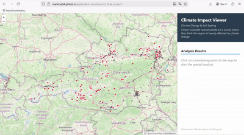

# Climate Impact Viewer – Citizen Science & Soil Sealing

## Project Description

This project was developed as part of a university assignment to visualize the impact of soil sealing in Austria using Citizen Science data. The interactive 
dashboard allows users to analyze sealing levels at any given location and understand the environmental footprint in specific areas.

## Project Demo
Below you can see the application in action two different times. Even without the WPS extension, the frontend-based sampling calculates the soil sealing levels dynamically upon clicking:

 

## Features

* **Interactive Map:** Visualization of soil sealing raster data and citizen locations (vector data) provided via GeoServer.
* **Area Analysis:** Clicking anywhere on the map generates a 500m buffer and calculates the average soil sealing level of the surrounding area.
* **Heat Risk Assessment:** Automatic classification of heat risk based on the calculated percentage values (Low, Medium, High).
* **Dynamic Visualization:** Integration of OpenStreetMap as a base layer with custom data overlays.

## Technical Implementation

* **Frontend:** Built with HTML5, CSS3, and JavaScript using the OpenLayers API.
* **Backend:** GeoServer was utilized to serve geospatial data through WMS and WFS interfaces.

## Technical Limitation: WPS Extension

The original goal was to perform precise area-based calculations using the **GeoServer WPS (Web Processing Service)** and the `gs:Aggregate` process.

However, due to **missing administrator privileges** on the provided laptop, it was not possible to install the required WPS extension into the 
GeoServer's program directory. Without this plugin, the server returns a `404 Not Found` error when attempting to process WPS requests.

**The Workaround:**
To ensure the project remained functional, I implemented a **mathematical sampling method** in the frontend. The average value is determined by querying 
the raster data at specific coordinates to provide a realistic approximation of the sealing degree within the 500m radius. I hope this creative problem-solving 
approach meets the project's requirements.

## Future Outlook

If administrator rights were available, the WPS plugin could be installed to utilize server-side "Zonal Statistics," which would offer even higher precision 
for area-based environmental analysis.

---

## AI Disclaimer
This project was developed with the assistance of Artificial Intelligence to support complex coding tasks, troubleshoot technical server errors, and assist in the documentation process. All AI-generated suggestions were reviewed, adapted, and tested to ensure they align with the goals and functional requirements.
